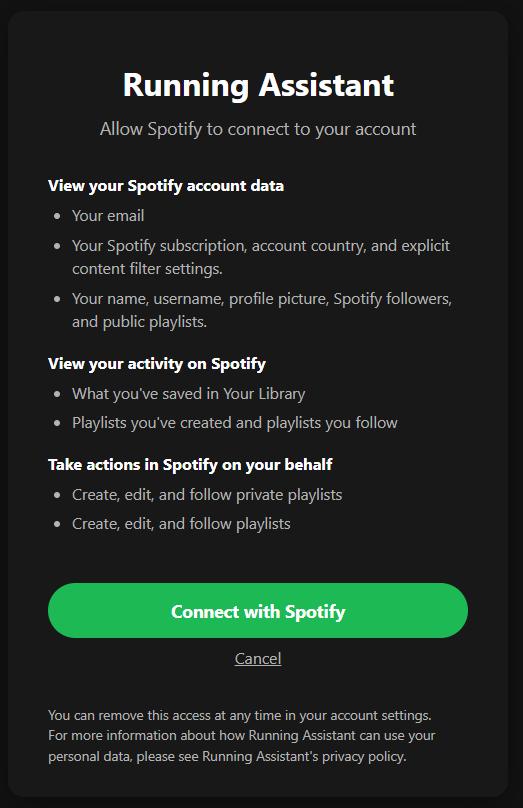
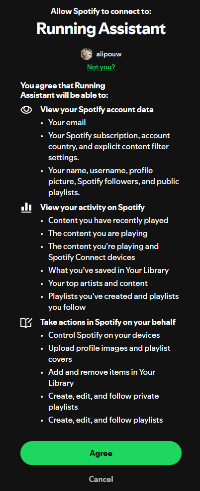
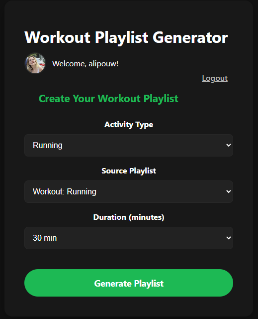
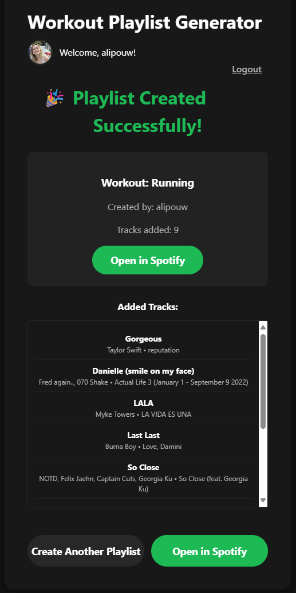
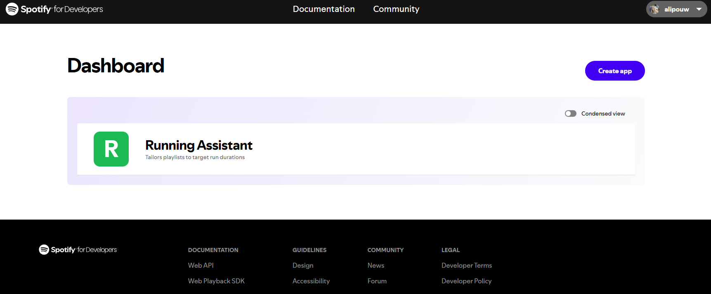
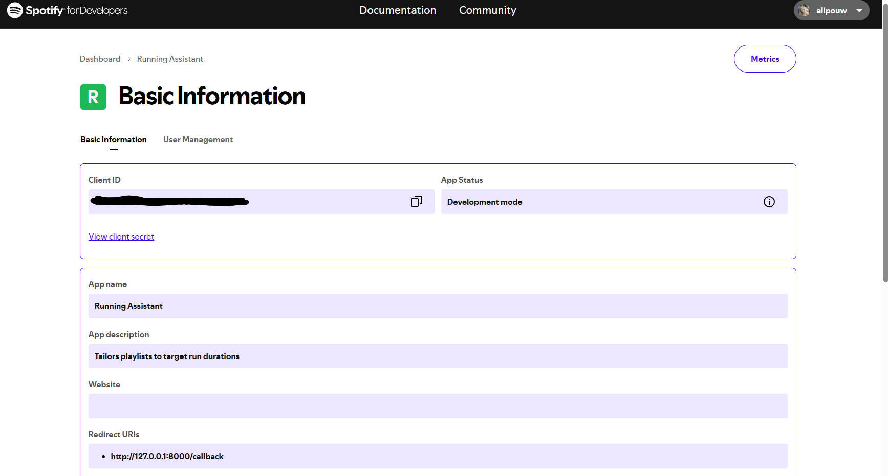

# Spotify Workout Playlist Generator

A web app to generate custom workout playlists from your Spotify library and playlists.

## Features

- **Spotify OAuth login** (PKCE, secure)
- **Select activity type** (Running, Cycling, Gym, Yoga)
- **Select a source playlist** from your Spotify playlists
- **Set playlist duration** (choose from 5 minutes to 12 hours in 5-minute increments)
- **Smart track selection**: The app picks tracks from your chosen playlist to fit your requested duration (±2 minutes)
- **Modern, Spotify-inspired UI**
- **Playlist is created in your Spotify account** with a link to open in Spotify

## Workflow

| Step | Visual |
|--|--|
| 1 |  |
| 2 |  |
| 3 |  |
| 4 |  |

## Prerequisites

Before you begin, you'll need a Spotify Developer account and a registered app:

1. **Create a Spotify Developer Account**
   - Go to the [Spotify Developer Dashboard](https://developer.spotify.com/) and log in with your Spotify account (or create one if you don't have it).

2. **Create a new app**
   - In the dashboard, click "Create an App".
   
   
   
   - Give your app a name and description.
   - After creation, you'll see your **Client ID** and **Client Secret**.
   
   

3. **Set the Redirect URI**
   - In your app settings, add your redirect URI (e.g., `http://localhost:4000/api/auth/callback` or as specified in your `.env`).
   - Save the changes.

4. **Copy your credentials**
   - You'll need the **Client ID**, **Client Secret**, and **Redirect URI** for your `.env` file in the backend.

> For more details, see the [Spotify Developer Documentation](https://developer.spotify.com/).

## Getting Started

1. **Clone the repo**
2. **Set up your Spotify Developer credentials** in a `.env` file (see `.env.example`)
3. **Install dependencies** in both `backend/` and `frontend/`
4. **Run the backend and frontend**

## Usage

1. Log in with your Spotify account
2. Select your activity type
3. Choose a source playlist from your Spotify playlists
4. Select the desired playlist duration
5. Click "Generate Playlist"
6. Open your new playlist in Spotify!

## Development

- Frontend: React + Vite (`frontend/`)
- Backend: Node.js + Express (`backend/`)

### Running the App Locally (Development)

1. **(Optional) Create a Python virtual environment**
   
   If you plan to run Python scripts or tests (e.g., in the `tests/` folder), it's recommended to create a virtual environment in the project root:
   
   ```bash
   python -m venv venv
   # Activate on Windows:
   venv\Scripts\activate
   # Activate on macOS/Linux:
   source venv/bin/activate
   ```

2. **Install dependencies**
   
   Open two terminals (or use tabs):
   
   In the `backend/` directory:
   ```bash
   cd backend
   npm install
   ```
   
   In the `frontend/` directory:
   ```bash
   cd frontend
   npm install
   ```

3. **Start the backend server**
   
   In the `backend/` directory:
   ```bash
   npm start
   ```
   By default, the backend runs on [http://localhost:4000](http://localhost:4000)

4. **Start the frontend development server**
   
   In the `frontend/` directory:
   ```bash
   npm run dev
   ```
   By default, the frontend runs on [http://127.0.0.1:8000](http://127.0.0.1:8000)

5. **Open the app**
   
   Visit [http://127.0.0.1:8000](http://127.0.0.1:8000) in your browser.

> Make sure your `.env` file is set up in the `backend/` directory with your Spotify credentials.

## Customization

- Add your own screenshots to `frontend/src/assets/` for the README
- Tweak the playlist selection algorithm in `backend/mcpClient.js`

## License

This project is licensed under the MIT License 
